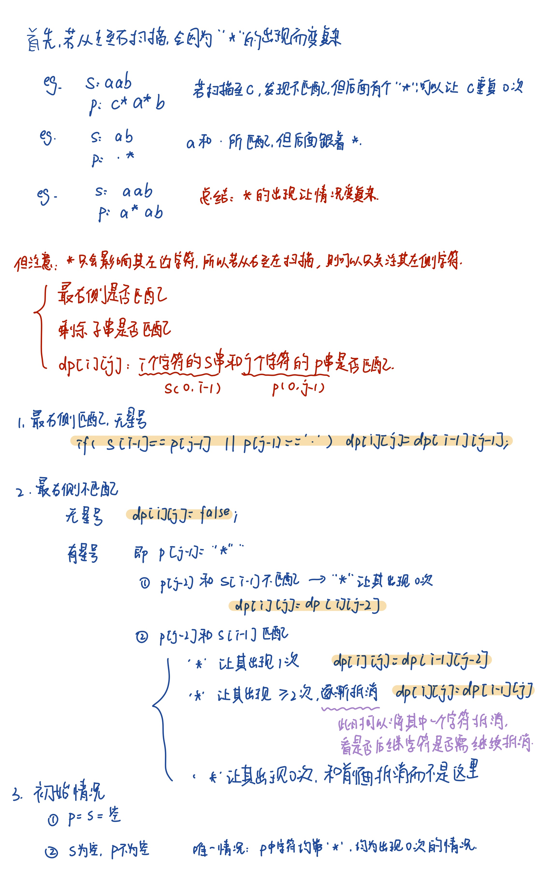

### 4

count表示**处理了几个元素**，它模拟走过合并数组的前 `mid2 + 1` 个元素

nums1:1,3,5,7,9
nums2:2,4,6,8,10
mid1=4,mid2=5

| count | pre  | cur  | index1 | index2 | nums1[index1] | nums2[index2] |
| ----- | ---- | ---- | ------ | ------ | ------------- | ------------- |
| 0     | 0    | 0    | 0      | 0      | 1             | 2             |
| 1     | 0    | 1    | 1      | 0      | 3             | 2             |
| 2     | 1    | 2    | 1      | 1      | 3             | 4             |
| 3     | 2    | 3    | 2      | 1      | 5             | 4             |
| 4     | 3    | 4    | 2      | 2      | 5             | 6             |
| 5     | 4    | 5    | 3      | 2      | 7             | 6             |

nums1:1,3
nums2:2
mid1:1,mid2:1

| count | pre  | cur  | index1 | index2 | nums1[index1] | nums2[index2] |
| ----- | ---- | ---- | ------ | ------ | ------------- | ------------- |
| 0     | 0    | 0    | 0      | 0      | 1             | 2             |
| 1     | 0    | 1    | 1      | 0      | 3             | 2             |

### 41

```c++
class Solution {
public:
    int firstMissingPositive(vector<int>& nums) {
        int n = nums.size();
        for (int i = 0; i < n; i++) {
            // 把 nums[i] 放到正确的位置上
            while (nums[i] > 0 && nums[i] <= n && nums[nums[i] - 1] != nums[i]) {
                swap(nums[i], nums[nums[i] - 1]);
            }
        }
        // 找到第一个不匹配的位置
        for (int i = 0; i < n; i++) {
            if (nums[i] != i + 1) return i + 1;
        }
        return n + 1;
    }
};
```

置换排序：把每个正数 `x` 放到下标 `x-1` 的位置，例如 `1` 放到 `nums[0]`，`2` 放到 `nums[1]`

### 42

思路：对于位置 `i`，它最多能接的水是 **min(左边最高柱子, 右边最高柱子) - height[i]**

### 10

动态规划：dp\[i][j]表示s[0:i-1]能否与p[0:j-1]相匹配



### 32

如何想到的**dp[i] 表示以 s[i] 结尾的最长有效括号子串的长度**

1. 成对的括号总是以）结尾
2. ==把状态 `dp[i]` 定义为以当前位置结尾的某种“最优子结构”==
   1. 最长上升子序列（LIS）：dp[i] 表示以 a[i] 结尾的 LIS 长
   2. 最大子数组和：dp[i] 表示以 a[i] 结尾的最大子数组和

### 46

Q：关于使用**回溯**时为什么有时用的是循环而有时不用循环：
A：**本质问题：当前决策有几个可选项**

> 回溯本质上是在每一个决策点穷举所有可能的选择，看当前决策点可以干什么，在46题中，每次只面临两个决策`是否要选择当前元素`，所以单独写这两个选项即可，而需要for循环的情况则大多出现在排列中，这类问题对顺序没有要求，只需要从剩下任意没用过的元素中选择一个来填充当前位置即可（如第78题）

### 29

首先，关于INT_MAX和INT_MIN的值：

- INT_MIN = -2,147,483,648 （即 -2³¹）
- INT_MAX = 2,147,483,647 （即 2³¹ - 1）

所以需要注意的第一点是一个特殊情况：当dividend == INT_MIN && divisor == -1时理论上结果应该是INT_MIN / -1 = 2,147,483,648；但是这个值超过了 INT_MAX（最大能表示到 2,147,483,647），所以会发生整数溢出（undefined behavior）

需要注意的第二点是这里的左移

- 左移<<1=乘2
- 右移>>1=除以2

这里巧妙利用了这一个特性，若被除数大于除数则将除数和商均左移1位
可能出现的情况比如

```
如果 a = 46, b = 5
第一次 temp = 5, temp << 1 = 10 ✅
temp = 10, temp << 1 = 20 ✅
temp = 20, temp << 1 = 40 ✅
temp = 40, temp << 1 = 80 ❌（超过 a=43）
-----------------------------------------
a-=temp，即a=6,res=8
a满足>=b的条件，temp=b=5，此时重新从temp<<1即10开始，不满足a>=(temp<<1)的条件，直接进行a-=temp，即a=1，multiple = 9
所以最终的 res=9
```

### 187

```c++
for(int i=0;i<s.size()-10;i++){
            string temp=s.substr(i,10);
            hmap[temp]++;
            cout<<1;
        }
```

Q：在s.size()==1的情况下为什么还会进入循环输出1？
A：`s.size()` 的返回类型是 `size_t`，是 **`unsigned`**，`s.size() - 10` 结果也就成了一个非常大的无符号数（因为 `1 - 10` 变成了一个超大的值，像 `18446744073709551607`）这就叫 **unsigned underflow（无符号整数下溢）**

### 	401

题目解释：

- **4 个灯表示小时**（0–11），位置编号 `0~3`
- **6 个灯表示分钟**（0–59），位置编号 `4~9`

参数含义

- index：当前考虑的灯的编号（0-9）
- count：当前已经亮的灯的数量
- hour：小时值（位运算）
- minute：分钟值（位运算）

逻辑

```c++
for (int i = index; i < 10; i++) {
    if (i < 4)
        backtrack(i + 1, count + 1, hour | (1 << i), minute);
    else
        backtrack(i + 1, count + 1, hour, minute | (1 << (i - 4)));
}
```

首先，你是不是想着，他必须把“时”先全部点亮之后才能点亮“分”，但是！！你忘记了一件事情，**这是个循环！**这里的“i+1”可以**保证下一轮循环时，可选择的灯序号在当前选择的灯序号后面，不会重复选择之前的灯**，比如上一轮已经选择了0号灯，下一轮就只会在1-9号灯里面选，即i会遍历1-9，count表示在下一轮的时候已经点亮的几个灯

- i = 1 → 选小时灯第 1 位
- i = 2 → 选小时灯第 2 位
- i = 3 → 选小时灯第 3 位
- i = 4 → 选分钟灯第 0 位
- i = 5 → 选分钟灯第 1 位
- ......

### 827

==**如何进行上下左右四个方向的遍历**==

```c++
vector<pair<int,int>> dirs={{1,0},{-1,0},{0,1},{0,-1}};

for(int i=0;i<row;i++){
    for(int j=0;j<col;j++){
        for(auto& d:dirs){
            int r=i+d.first;
            int c=j+d.second;
            ......
        }
        ......
    }
}
```

### 210

返回时，如果要返回空的vector数组，有两种写法：

```c++
//第一种：        
if(res.size()==numCourses)
    return res;
return {};

//第二种
return res.size()==numCourses?res:vector<int>{};
```

注意这里的第二种写法

### 337

这个问题本质上是一个**树形dp+dfs**问题

首先，这里树的约束是「父子关系」，而不是「同层 vs 不同层」，如果按我本来的理解，是max{奇数层的总和，偶数层的总和}，但是还会出现一种情况比如
```markdown
    4
   /
  1
 /
2
 \
  3
```

此时最大值应该是4+3而不是4+2

Q1：那么该如何想到dp+dfs的组合呢？

> 首先，题目条件是不能同时偷父子节点，所以**「在每个节点上，会考虑两个状态：偷/不偷」**
> 其次，在前面失败一次后，很自然可以想到一种情况，也就是我偷的不是父亲和孙子节点，而是父亲和曾孙节点，也就是前文所示，那么如何知道该偷孙子还是曾孙呢，肯定要看孙子节点和曾孙节点或者更小的节点，也就是要**「自底向上」**，也就是dfs的思想：**「从根一路递归到叶子再返回，完成一个自底向上的dp转移」**

Q2：第二个问题是，这里对于每个节点有两个状态「偷/不偷」，正常dp是一个状态数组，这里怎么标识两个状态呢
A：pair<int,int>标识两个状态，或者其实二维数组也可。
		可以用返回值或者全局数组表示

Q3：确定顺序？
A：一般来说，像线性dp

- 一维数组可能是从左到右遍历
- 区间dp可能要按区间长度递增枚举
- 背包dp要注意循环顺序

​		像这种树形dp，可能就是自底向上的顺序
